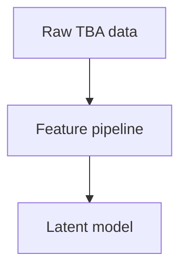

# Obsidian Format Guide

Use this guide when writing Obsidian-native or hybrid notes in the LatentStrat `docs/` vault.

Obsidian supports CommonMark, GitHub Flavored Markdown, LaTeX/MathJax math, and Obsidian-specific extensions. Repo-facing docs should stay GitHub-readable unless the user asks for Obsidian-native behavior.

## Line Wrapping

Do not manually hard-wrap prose in Obsidian vault notes. Write normal paragraphs and let Obsidian soft-wrap text in the editor.

Use explicit line breaks only when Markdown structure requires them:

- headings
- list items
- tables
- code blocks
- blockquotes and callouts
- intentional paragraph breaks

When editing an already hard-wrapped paragraph, avoid making the wrapping worse. If a paragraph is being materially edited, prefer leaving it as one logical line unless that would create an unreadable Markdown table, list, or code block.

## Formatting Modes

| Mode | Use when | Link style | Allowed Obsidian features |
|---|---|---|---|
| Repo documentation | README-linked docs, CLI docs, runbooks, architecture docs | Standard Markdown links | Avoid Obsidian-only features unless requested |
| Obsidian-native note | MOCs, concept notes, research notes, private graph navigation | `[[wikilinks]]` | Wikilinks, backlinks, tags, properties, callouts, embeds, block refs |
| Hybrid docs note | Useful in both GitHub and Obsidian | Standard Markdown by default | Tags/properties and selective wikilinks only when justified |

## Links

GitHub-readable:

```md
[Architecture](model-structure.md)
```

Obsidian-native:

```md
[[Model Structure]]
[[Model Structure#Decision Log]]
[[Model Structure|architecture overview]]
```

Block references are Obsidian-native only:

```md
[[Model Structure#^latent-prior]]
```

## Properties

Properties are YAML. Keep them atomic, and do not put rich Markdown prose in properties.

```yaml
---
tags:
  - latentstrat
  - model-notes
aliases:
  - Latent Strategy Notes
status: draft
related:
  - "[[Model Structure]]"
---
```

Internal links inside properties must be quoted.

## Tags

Prefer lowercase kebab-case. Nested tags may use `/`.

Good:

```md
#model-selection
#scouting/data-ingestion
```

Avoid spaces and purely numeric tags:

```md
#Model Selection
#2290
```

## Callouts

Callouts are mostly Obsidian-native. Use them for vault-native notes or when repo portability is not critical.

```md
> [!note] Design note
> This is useful contextual information.

> [!warning] Repo portability
> Avoid this in public-facing GitHub docs unless acceptable.
```

## Embeds And Attachments

Repo and hybrid notes must use durable assets under `docs/assets/` with standard Markdown image syntax:

```md

```

Use Obsidian embeds only in Obsidian-native notes:

```md
![[system-flow.png]]
![[Model Structure#Latent Prior]]
```

## Mermaid

Mermaid code blocks are mostly GitHub-readable and useful for architecture diagrams.

````md

````

## LaTeX Math

Use LaTeX math when it materially improves technical clarity.

```md
The ridge penalty is $\lambda \|w\|_2^2$.

$$
\hat{x} = (P^T P + \lambda I)^{-1} P^T y
$$
```

Avoid Obsidian-only block references around equations in repo-facing docs.

## Tables

Escape wikilink alias pipes in tables.

```md
| Topic | Link |
|---|---|
| Architecture | [[Model Structure\|overview]] |
```

## References

- Obsidian Flavored Markdown: https://obsidian.md/help/obsidian-flavored-markdown
- Internal links: https://obsidian.md/help/links
- Properties: https://obsidian.md/help/properties
- Tags: https://obsidian.md/help/tags
- Callouts: https://obsidian.md/help/callouts
- Advanced formatting: https://obsidian.md/help/Editing%2Band%2Bformatting/Advanced%2Bformatting%2Bsyntax
