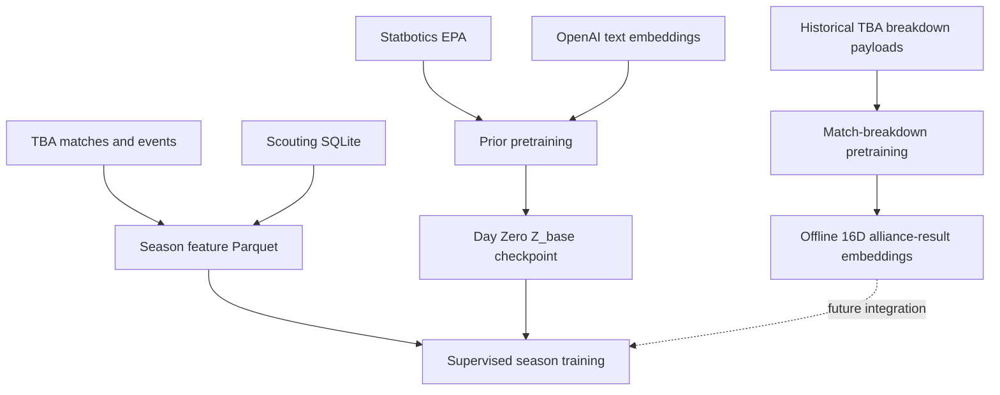

# Architecture

LatentStrat separates offline pretraining from supervised season learning.



## Season Model

For each team at an event:

```text
z_team_event = Z_base[team] + Z_event[team, event]
```

Each alliance provides three team slots. The Set Transformer applies self-attention within each
alliance, cross-alliance attention, and PMA pooling. Existing supervised heads predict continuous
score targets, winner probability, fouls, bonuses, endgame labels, and awards.

`ForwardOutput` is grouped by responsibility:

```text
ForwardOutput
  representations: MatchRepresentations
  predictions: TaskPredictions
  masks: SlotMasks
```

`TaskPredictions` is keyed so experimental heads do not require a positional return signature.

## Checkpoints

Season checkpoints write `checkpoint.pt`. Loading is centralized in
`latentstrat.artifacts.checkpoints`:

- V5.8 historical checkpoints load through a compatibility path.
- Historical schema-`6` checkpoints remain strict-load compatible.
- V6.1 schema-`6` checkpoints retain the same registered parameter keys.

## Boundaries

- `latentstrat.pretraining`: offline representations.
- `latentstrat.season`: supported supervised workflow surfaces.
- `latentstrat.artifacts`: manifests, hashing, and checkpoint loading.
- `latentstrat.experimental`: unfinished target spaces and venue-mode training.
- `latentstrat.dev`: exploratory diagnostics.

For detailed training commands, see [Season training](season-training.md).
