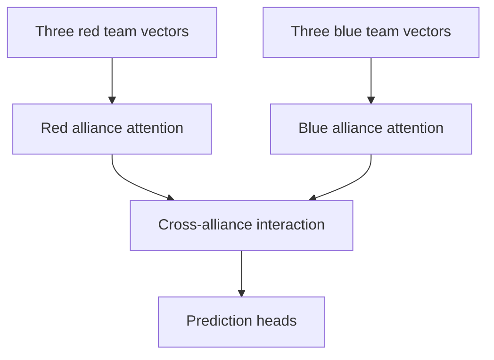
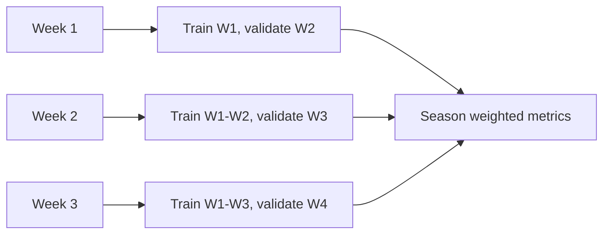

---
tags:
  - latentstrat
  - season-training
  - model-architecture
aliases:
  - "Season Training"
  - "V6-Lite Season Training"
  - "Walk-Forward Training"
related:
  - "[[prior-training]]"
  - "[[feature-pipeline]]"
  - "[[training-and-validation]]"
  - "[[model-structure]]"
  - "[[metrics-and-artifacts]]"
---

# Season Training

Season training teaches LatentStrat how teams behave in real matches. It starts from the Day Zero prior and learns event-specific evidence from the season.

For exact tensor shapes, head dimensions, parameter counts, and equations, see the [Model Architecture Reference](model-architecture-reference.md).

V6-Lite keeps the V5 supervised trunk and adds frozen offline target spaces. Read
[V6-Lite](V6-Lite.md) for the canonical phase roadmap.

## The Two Team Vectors

LatentStrat uses two team embedding tables during match training:

- `Z_base`: long-term team identity, initialized from the prior checkpoint.
- `Z_event`: event-local adjustment, learned from event and season evidence.

The model combines them when representing a team:

```text
team representation = Z_base[team_number] + Z_event[event_team_index]
```

`Z_base` answers: what did we know before the event?

`Z_event` answers: what has this team shown at this event?

## Match Input Shape

Each match row has six robot slots:

- `red_team_1_key`
- `red_team_2_key`
- `red_team_3_key`
- `blue_team_1_key`
- `blue_team_2_key`
- `blue_team_3_key`

For V5.6+ indexing:

- `frc####` maps directly to base row `####`.
- Missing slots map to base row `0`, the learned ghost robot.
- Event rows use contiguous event-team indices.
- Event row `0` means no event-local delta.

## Set Transformer Role

FRC alliances are unordered groups of robots. Swapping red team 1 and red team 2 should not fundamentally change the prediction. The Set Transformer is used because it can learn interactions inside and across alliances without relying on slot order as the main signal.

At a high level:



## Match-Spine Targets

The match spine trains several target groups:

- Phase points such as auto and teleop points.
- Win probability.
- Endgame state.
- Judged award auxiliary labels.
- V5.7 atomic count targets.
- V5.7 committed foul targets.
- V5.7 bonus binary targets.
- V5.7 special binary targets.

Binary heads output raw logits. Losses use `BCEWithLogitsLoss`, not a separate sigmoid followed by BCE.

Missing score-breakdown targets stay `NaN` and are masked at loss time.

## Sidecar Training

Sidecars are optional post-event labels. They shape the representation but are not pre-match input features.

The sidecar tasks are:

- Qualification ranking pairs.
- Playoff alliance ranking pairs.
- Alliance selection triplets: captain, selected pick, and computed passed-over team.

Sidecar loaders can be much smaller than the match loader. The match loader drives the epoch, while non-empty sidecar loaders are cycled.

## V6-Lite Frozen Targets

V6-Lite V1 builds historical score-archetype targets offline. The match-breakdown encoder uses
separate raw schemas per eligible season and one shared 16D bottleneck. It is not attached to
season training yet, so score embedding configuration remains disabled.

Award, completed-ranking, and pick-desirability target-space scaffolds remain available for later
phases. The main runtime selection predictor receives only captain and candidate latents;
ranked-unselected pool context stays inside the offline builder.

## Stability Patch

The 100-epoch V5.7 run showed a classic failure mode: training loss kept improving while validation exploded. The V5.7.2 stability patch added:

- Homoscedastic log-var clamping.
- Best-validation restoration even when early stopping is disabled.
- Cosine learning-rate decay.
- AdamW decay for Set Transformer and head weights while embeddings keep active-row regularization.

This lets long TensorBoard-monitored runs continue while still saving the best validation state.

## Walk-Forward Validation

Random splits can leak time. Walk-forward validation is the primary V5.8 validation path.

For each fold:

```text
Train on weeks <= N
Validate on week N + 1
Reset model back to the Day Zero prior for the next fold
```

Each fold starts fresh from the prior checkpoint. The model does not carry weights from one fold to the next.



Sidecars are pre-filtered:

- Training sidecars: `event_week <= train_max_week`.
- Validation sidecars: `event_week == val_week`.

This prevents future rankings, selections, or playoffs from reaching earlier training folds.

## Training Commands

Standard feature training:

```bash
latentstrat train-features data/features/season/features_v58_2026.parquet \
  --output artifacts/season/features_run \
  --prior-checkpoint artifacts/prior/prior_v564_latent16/checkpoint.pt \
  --tensorboard
```

Frozen-prior transformer warmup trains the Set Transformer blocks, prediction heads, ranking/playoff sidecar heads, and loss balancer while keeping both `Z_base` and `Z_event` fixed. Use it after building a prior checkpoint when you want match-dynamics layers to warm up before full-network fine-tuning:

```bash
latentstrat train-features data/features/season/features_v58_2026.parquet \
  --output artifacts/season/frozen_prior_warmup_sidecars \
  --prior-checkpoint artifacts/prior/prior_v564_latent16/checkpoint.pt \
  --split-policy stratified-event-comp \
  --freeze-team-embeddings \
  --rankings-sidecar data/sidecars/v58_2026/rankings_2026.parquet \
  --playoffs-sidecar data/sidecars/v58_2026/playoffs_2026.parquet \
  --tensorboard
```

`--freeze-team-embeddings` requires either `--prior-checkpoint` or `--checkpoint` so random team embeddings are not frozen by accident. It cannot be combined with venue mode, because venue mode intentionally trains `Z_event`. Keep selection sidecars for the later full-network fine-tune unless a trainable selection projection/head is added; the current selection triplet loss acts directly on frozen team/event latents during this warmup.

With sidecars:

```bash
latentstrat train-features data/features/season/features_v58_2026.parquet \
  --output artifacts/season/v58_full_season_common_metrics_100 \
  --epochs 100 \
  --no-early-stopping \
  --restore-best \
  --prior-checkpoint artifacts/prior/prior_v564_latent16/checkpoint.pt \
  --rankings-sidecar data/sidecars/v58_2026/rankings_2026.parquet \
  --selections-sidecar data/sidecars/v58_2026/selections_2026.parquet \
  --playoffs-sidecar data/sidecars/v58_2026/playoffs_2026.parquet \
  --tensorboard
```

Walk-forward:

```bash
latentstrat validate-walk-forward \
  --features data/features/season/features_v58_2026.parquet \
  --prior-checkpoint artifacts/prior/prior_v564_latent16/checkpoint.pt \
  --rankings-sidecar data/sidecars/v58_2026/rankings_2026.parquet \
  --selections-sidecar data/sidecars/v58_2026/selections_2026.parquet \
  --playoffs-sidecar data/sidecars/v58_2026/playoffs_2026.parquet \
  --output artifacts/walk-forward/v58_walk_forward_v564_latent16_50ep_2026 \
  --epochs 50 \
  --mini-batch-size 256 \
  --latent-dim 16 \
  --no-save-fold-checkpoints \
  --tensorboard
```

## TensorBoard

Training commands write TensorBoard logs under `runs/` by default. Use:

```bash
tensorboard --logdir=runs
```

For walk-forward runs, the layout includes:

- A summary run with fold-level metrics.
- One subrun per fold with epoch-level training curves.

## Outputs

Season training writes files such as:

- `feature_history.csv`
- `feature_common_metrics.csv`
- `feature_binary_metrics.csv`
- `feature_continuous_metrics.csv`
- `feature_calibration.csv`
- `feature_availability_slices.csv`
- `feature_endgame_metrics.csv`
- `feature_award_metrics.csv`
- `feature_set_attention.csv`
- `feature_zero_out_diagnostics.csv`
- `feature_team_attention_summary.csv`
- `feature_team_zero_out_sensitivity.csv`
- `feature_embedding_drift.csv`
- `feature_event_delta_summary.csv`
- `feature_selection_value.csv`
- `feature_training_loss.png`
- `feature_task_losses.png`
- `feature_task_precision_evolution.png`
- `feature_win_calibration.png`
- `feature_attention_entropy.png`
- `feature_zero_out_delta_rmse.png`
- `feature_pma_carry_support.png`
- `feature_zero_out_war.png`
- `feature_embedding_drift_quiver.png`
- `feature_event_delta_by_week.png`
- `feature_team_value_vs_draft_pick.png`
- `v6_checkpoint.pt`

Walk-forward writes:

- `walk_forward_metrics.csv`
- `walk_forward_history.csv`
- `walk_forward_predictions.parquet`
- `config.json`
- optional fold checkpoints.

Read [Metrics and artifacts](metrics-and-artifacts.md) for interpretation.

## Related

- [Feature pipeline](feature-pipeline.md): how match rows, score breakdowns, canonical weeks, and sidecars are built.
- [Training and validation](training-and-validation.md): broader training workflow, TensorBoard policy, and validation context.
- [Model structure](model-structure.md): readable description of the Set Transformer, heads, and team vectors.
- [Model architecture reference](model-architecture-reference.md): exact tensor shapes and training equations.
- [Metrics and artifacts](metrics-and-artifacts.md): how to interpret `feature_*` and `walk_forward_*` outputs.
