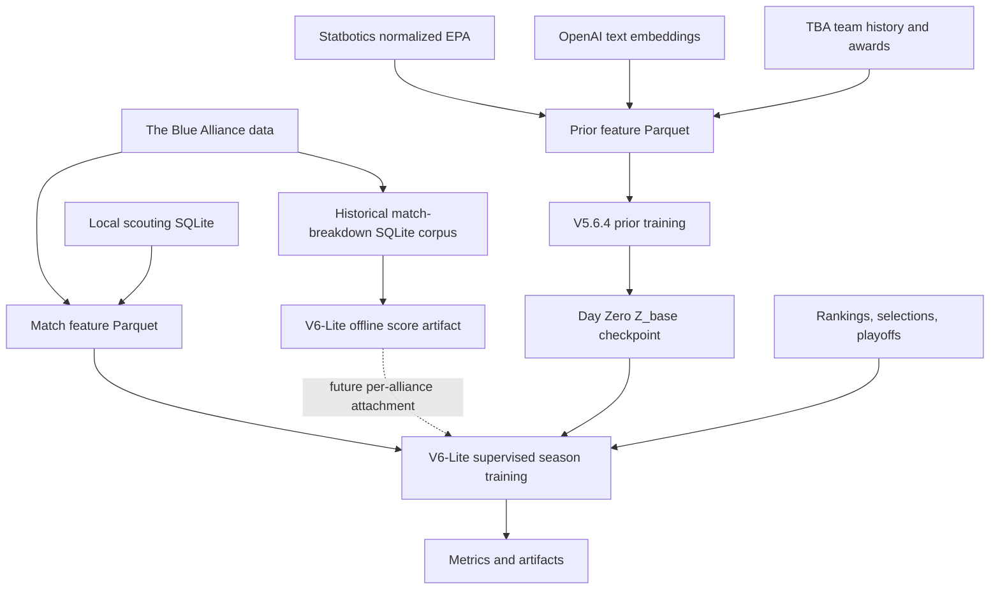

---
tags:
  - latentstrat
aliases:
  - "LatentStrat Documentation Hub"
  - "Docs Index"
related:
  - "[[student-primer]]"
  - "[[current-state]]"
  - "[[rebuild-from-scratch]]"
  - "[[experiment-ledger]]"
---

# LatentStrat Documentation Hub

LatentStrat is a scouting and strategy model for FIRST Robotics Competition data. It learns a compact mathematical identity for each team, updates that identity as a season or event unfolds, and predicts match outcomes and other signals that matter to strategy.

This vault is written for two readers:

- An FRC student who wants to understand what the tool is doing.
- A developer who wants to rebuild LatentStrat from scratch.

## Start Here

If you are new to the project, read in this order:

1. [Student primer](student-primer.md): plain-language project overview for FRC students.
2. [Current state](current-state.md): what the current implementation is and which artifacts are recommended.
3. [Changelog](changelog.md): how semantic versions connect to Git commits and local artifact eras.
4. [Data sources](data-sources.md): where the model gets its information.
5. [Prior training](prior-training.md): how teams get Day Zero identities before matches are played.
6. [V6-Lite design](V6-Lite.md): frozen FRC target spaces and phased promotion gates.
7. [Season training](season-training.md): how the model learns from matches, sidecars, and walk-forward validation.
8. [Model architecture reference](model-architecture-reference.md): exact tensor shapes, layer sizes, parameter counts, and equations.
9. [Metrics and artifacts](metrics-and-artifacts.md): how to read the outputs.
10. [Project history](project-history.md): what experiments were tried and what changed because of them.
11. [Experiment ledger](experiment-ledger.md): local run evidence and design lessons.
12. [Rebuild from scratch](rebuild-from-scratch.md): commands to reproduce the current pipeline.

## The Big Idea

Every FRC team has patterns that are visible before a match starts:

- Long-running teams often have durable institutional knowledge.
- Some teams have a history of strong software, autonomous routines, or build quality.
- Some rookies or future team numbers have no match history, but they still need a stable placeholder in the model.
- A team can be different at each event, because robots improve, break, or get driven differently.

LatentStrat separates those ideas into two learned vectors:

- `Z_base`: the team identity that exists before the event. This is initialized by prior training.
- `Z_event`: the event-specific adjustment learned from current-season or current-event matches.

The match model then asks: given the three red robots and the three blue robots, how do these six learned identities interact?

## How The Pipeline Fits Together

## Guided Paths

### How Teams Are Learned

Read [Prior training](prior-training.md) if you want to understand:

- Why team `0` is a learned ghost robot.
- How team numbers map directly into a learned dictionary.
- How narratives, normalized EPA trajectory, and culture targets shape the Day Zero prior.
- Why the decoder is discarded after prior training.

### How A Season Is Learned

Read [Season training](season-training.md) if you want to understand:

- How match rows become tensors.
- How `Z_base` and `Z_event` work together.
- Why sidecars are training labels but not pre-match inputs.
- Why walk-forward validation is safer than a random split.

### How To Read Results

Read [Metrics and artifacts](metrics-and-artifacts.md) if you want to understand:

- Brier score, log loss, match accuracy, and score MSE.
- Prior inspection files such as PCA plots and nearest-neighbor CSVs.
- Historical match-breakdown inspection plots for score gradients, season structure, and cross-season analogies.
- Feature training outputs such as `feature_history.csv`.
- Walk-forward outputs such as `walk_forward_metrics.csv`.

### How To Rebuild Everything

Read [Rebuild from scratch](rebuild-from-scratch.md) when setting up a new machine or reproducing an experiment.

Read [CLI reference](cli-reference.md) when you need command-by-command details.

## Vault Map

Use these grouped links when you already know what kind of question you have.

### Beginner Path

- [Student primer](student-primer.md): FRC-student-friendly explanation.
- [Ghost robot](ghost%20robot.md): why team `0` exists.
- [Current state](current-state.md): current recommended stack and caveats.

### Rebuild Path

- [Rebuild from scratch](rebuild-from-scratch.md): end-to-end commands.
- [CLI reference](cli-reference.md): command-by-command details.
- [Schemas and artifacts reference](schemas-and-artifacts-reference.md): generated data and output contracts.

### Model Internals

- [Model structure](model-structure.md): readable architecture overview.
- [Model architecture reference](model-architecture-reference.md): exact tensor shapes, parameter counts, and equations.
- [V6-Lite design](V6-Lite.md): frozen target-space builders and promotion rules.
- [Prior training](prior-training.md): Day Zero prior and checkpoint handoff.
- [Season training](season-training.md): Set Transformer training and walk-forward validation.
- [V5.7 notes](V5.7.md): sensor-fusion transition notes.

### Data And Training

- [Data sources](data-sources.md): TBA, Statbotics, OpenAI, scouting, and sidecars.
- [Feature pipeline](feature-pipeline.md): feature-table construction.
- [Training and validation](training-and-validation.md): training workflow, TensorBoard, and validation boundaries.
- [Scouting data layer](scouting-data-layer.md): local SQLite scouting store.
- [Scouting data ingestion](scouting-data-ingestion.md): importer and CSV guidance.

### Metrics And History

- [Metrics and artifacts](metrics-and-artifacts.md): output interpretation.
- [Model evaluation](model-evaluation.md): baselines, controls, calibration, and evidence packets.
- [Embedding inspection](embedding-inspection.md): latent-space diagnostics.
- [Project history](project-history.md): narrative experiment history.
- [Experiment ledger](experiment-ledger.md): run evidence table.
- [Changelog](changelog.md): semantic versions and Git commit anchors.
